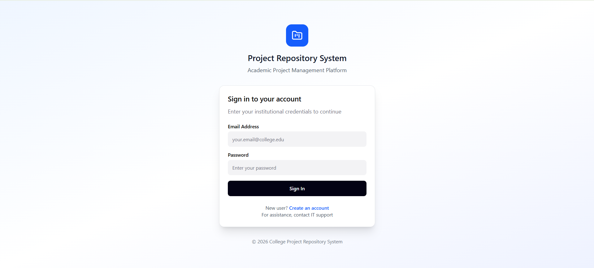
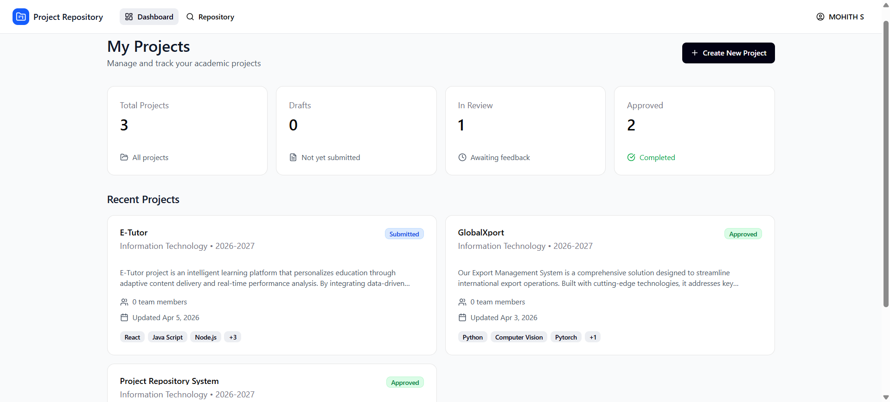
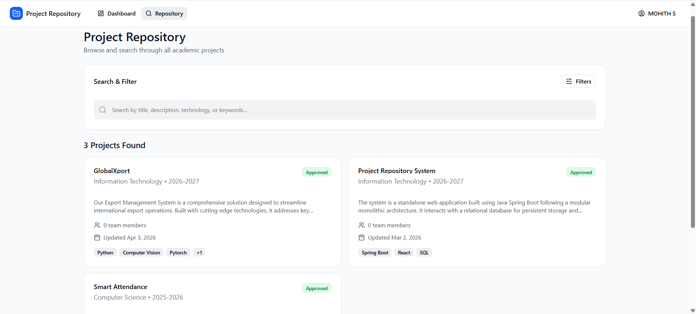
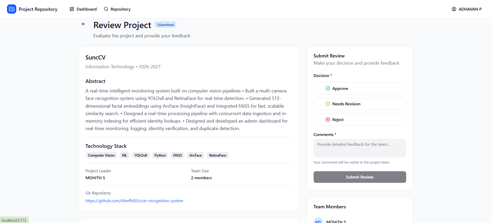
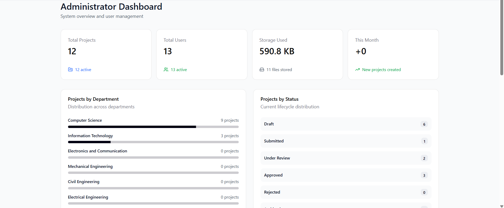
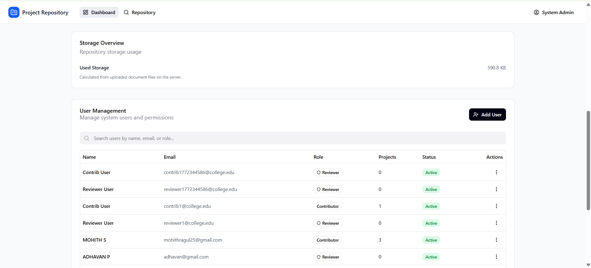

# 🚀 Project Repository System

<div align="center">


</div>

---

## 📖 Overview

Project Repository System is a workflow-driven project lifecycle management platform designed to streamline academic project submission, review, approval, and repository management.

The system replaces fragmented manual processes such as spreadsheets, emails, and paper-based tracking with a centralized platform that ensures secure collaboration, project traceability, structured reviews, and efficient project discovery.

### 🎯 Key Challenges Addressed

- Manual project submission workflows
- Lack of project visibility
- Unstructured review processes
- Missing audit trails
- Difficulty finding approved projects
- Unauthorized project access
- Duplicate submissions
- Inconsistent workflow transitions

---

## 📸 Application Screenshots

<div align="center">

### 🔐 Authentication & Login



### 📊 Dashboard



### 📁 Project Repository



### 📝 Review Workflow



### 👨‍💼 Admin Panel




</div>

---

## 🛠️ Tech Stack

### Backend

- **Java 17**
- **Spring Boot**
- **Spring Security**
- **Spring Data JPA**
- **Hibernate**
- **Maven**

### Frontend

- **React**
- **TypeScript**
- **Vite**
- **Axios**

### Database

- **MySQL**

### Security

- **JWT Authentication**
- **Role-Based Access Control (RBAC)**
- **Domain-Level Authorization**

### Cloud & Deployment

- **Azure App Service**
- **Azure Static Web Apps**
- **Railway MySQL**

---

## ✨ Core Features

### 🔐 Authentication & Authorization

- JWT-based Authentication
- Secure API Access
- Role-Based Access Control
- Domain-Level Authorization
- Stateless Session Management

### 📁 Project Lifecycle Management

- Project Creation and Management
- Draft Management
- Project Submission Workflow
- Reviewer Assignment
- Review and Approval Process
- Status Tracking
- Backend-Enforced State Transitions

### 📚 Approved Project Repository

- Searchable Approved Projects
- Centralized Repository
- Historical Project Records
- Knowledge Reuse and Discovery

### 📊 Search & Filtering

- Pagination Support
- Dynamic Filtering
- JPA Specification Queries
- Optimized Search Performance

### 🛡️ Reliability & Data Integrity

- Optimistic Locking
- Idempotent Submission Handling
- Concurrency Control
- Data Validation
- Consistent Workflow Enforcement

### 📋 Audit & Traceability

- Audit Logging
- Activity Tracking
- Review History
- State Transition Logs
- Complete Project Traceability

---

## 🔄 Project Workflow

```text
DRAFT
  │
  ▼
SUBMITTED
  │
  ▼
UNDER_REVIEW
  │
  ├────────► APPROVED
  │
  └────────► REJECTED
                  │
                  ▼
            EDIT & RESUBMIT
```

---

## 🏗️ System Architecture

```text
┌────────────────────┐
│ React + TypeScript │
│      Frontend      │
└─────────┬──────────┘
          │ REST API
          ▼
┌────────────────────┐
│    Spring Boot     │
│      Backend       │
└─────────┬──────────┘
          ▼
┌────────────────────┐
│ Spring Data JPA    │
│   Repositories     │
└─────────┬──────────┘
          ▼
┌────────────────────┐
│       MySQL        │
│     Database       │
└────────────────────┘
```

---

## 📂 Project Structure

```text
project-repository-system/
│
├── backend/
│   ├── controllers/
│   ├── services/
│   ├── repositories/
│   ├── entities/
│   ├── security/
│   └── audit/
│
├── frontend/
│   ├── src/
│   │   ├── pages/
│   │   ├── components/
│   │   ├── services/
│   │   └── hooks/
│
├── screenshots/
│
└── README.md
```

---

## 🚀 Getting Started

### Prerequisites

- Java 17+
- Maven
- Node.js 18+
- MySQL 8+

### Backend Setup

```bash
cd backend
mvn clean install
mvn spring-boot:run
```

### Frontend Setup

```bash
cd frontend
npm install
npm run dev
```

---

## 🌐 Deployment

### Backend

- Azure App Service

### Frontend

- Azure Static Web Apps

### Database

- Railway MySQL

---

## 🔮 Future Enhancements

- Real-Time Notifications
- Analytics Dashboard
- Mobile Application Support
- Multi-Level Review Workflow
- Recommendation System
- Academic ERP Integration

---

<div align="center">

Made with ❤️ by <a href="https://github.com/MOHITH2511">Mohit</a>

If you found this project useful, consider giving it a star!⭐

</div>